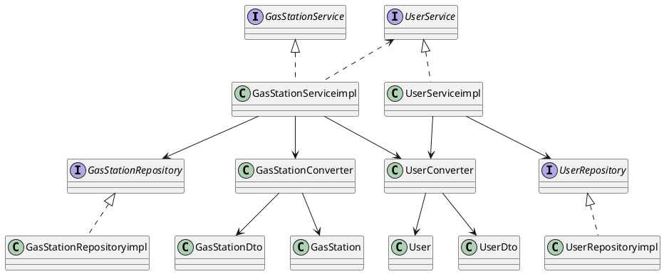

# Integration and API Test Documentation

Authors: Marco Bellavia (s280130), Gabriel Ganzer (s271961), Gianluca Morabito (s277943), Francesco Xia (s277509)

Date: 26/05/2020

Version: 1

# Contents

- [Dependency graph](#dependency graph)

- [Integration approach](#integration)

- [Tests](#tests)

- [Scenarios](#scenarios)

- [Coverage of scenarios and FR](#scenario-coverage)
- [Coverage of non-functional requirements](#nfr-coverage)

# Dependency graph 

     
# Integration approach
    
The tests were made by using a mixed approach including both the top down and bottom up strategies.

#  Tests

## Step 1

| Classes  | JUnit test cases | WB/BB |
|--|--|--|
|GasStationService.getGasStationById()                | GasStationServiceTests.testGetGasStationByIdNullStep1() | WB |
|		            | GasStationServiceTests.testGetGasStationByIdNegativeStep1() | WB |
|		            | GasStationServiceTests.testGetGasStationByIdPositiveStep1() | WB |
|GasStationService.saveGasStation()                   | GasStationServiceTests.testSaveGasStationNullStep1() | WB |
|		            | GasStationServiceTests.testSaveGasStationNewStep1() | WB |
|		            | GasStationServiceTests.testSaveGasStationExistingStep1() | WB |
|GasStationService.getAllGasStations()	               | GasStationServiceTests.testGetAllGasStationsStep1() | WB |
|GasStationService.deleteGasStation()                 | GasStationServiceTests.testDeleteGasStationIdNullStep1() | WB |
|		            | GasStationServiceTests.testDeleteGasStationByIdNegativeStep1() | WB |
|		            | GasStationServiceTests.testDeleteGasStationIdListedStep1() | WB |
|		            | GasStationServiceTests.testDeleteGasStationIdUnlistedStep1() | WB |
|GasStationService.getGasStationsByGasolineType()     | GasStationServiceTests.testGetGasStationsByGasolineTypeNullStep1() | WB |
|		            | GasStationServiceTests.testGetGasStationsByGasolineTypeInvalidStep1() | WB |
|		            | GasStationServiceTests.testGetGasStationsByGasolineTypeValidStep1() | WB |
|GasStationService.getGasStationsByProximity()	      | GasStationServiceTests.testGetGasStationsByProximityInvalidStep1() | WB |
|		            | GasStationServiceTests.testGetGasStationsByProximityValidStep1() | WB |
|GasStationService.getGasStationsWithCoordinates()    | GasStationServiceTests.testGasStationsWithCoordinatesNullStep1() | WB |
|		            | GasStationServiceTests.testGasStationsWithCoordinatesInvalidCoordinatesStep1() | WB |
|		            | GasStationServiceTests.testGasStationsWithCoordinatesInvalidFuelTypeStep1() | WB |
|		            | GasStationServiceTests.testGasStationsWithCoordinatesValidFieldsStep1() | WB |
|GasStationService.getGasStationsWithoutCoordinates() | GasStationServiceTests.testGasStationsWithoutCoordinatesNullStep1() | WB |
|		            | GasStationServiceTests.testGasStationsWithoutCoordinatesInvalidFuelTypeStep1() | WB |
|		            | GasStationServiceTests.testGasStationsWithoutCoordinatesValidFieldsStep1() | WB |
|GasStationService.setReport()                 		   | GasStationServiceTests.testSetReportGasStationIdNegativeStep1() | WB |
|		            | GasStationServiceTests.testSetReportUserIdNegativeStep1() | WB |
|		            | GasStationServiceTests.testSetReportPriceNegativeStep1() | WB |
|GasStationService.getGasStationByCarSharing()		   | GasStationServiceTests.testGetGasStationByCarSharingNullStep1() | WB |
|		            | GasStationServiceTests.testGetGasStationByCarSharingNotNullStep1() | WB |
| UserService.getUserById() | UserServiceTests.testGetUserByIdNullIdStep1() | WB |
| | UserServiceTests.testGetUserByIdNegativeIdStep1() | WB |
| | UserServiceTests.testGetUserByIdValidIdStep1() | WB |
| UserService.saveUser() | UserServiceTests.testSaveUserNullUserDtoStep1() | WB |
| | UserServiceTests.testSaveUserValidExistingUserDtoStep1() | WB |
| | UserServiceTests.testSaveUserValidNewUserDtoStep1() | WB |
| UserService.getAllUsers() | UserServiceTests.testGetAllUsersStep1() | BB |
| UserService.deleteUser() | UserServiceTests.testDeleteUserNullIdStep1() | WB |
| | UserServiceTests.testDeleteUserdNegativeIdStep1() | WB |
| | UserServiceTests.testDeleteUserValidIdNotExistsStep1() | WB |
| | UserServiceTests.testDeleteUserValidIdExistsStep1() | WB |
| UserService.login() | UserServiceTests.testLoginNullCredentialsStep1() | WB |
| | UserServiceTests.testLoginNullFieldsCredentialsStep1() | WB |
| | UserServiceTests.testLoginWrongCredentialsStep1() | WB |
| | UserServiceTests.testLoginCorrectCredentialsStep1() | WB |
| UserService.increaseUserReputaion() | UserServiceTests.testIncreaseUserReputationUserIdNullStep1() | WB |
| | UserServiceTests.testIncreaseUserReputationUserIdPositiveStep1() | WB |
| | UserServiceTests.testIncreaseUserReputationUserIdNegativeStep1() | WB |
| UserService.decreaseUserReputaion() | UserServiceTests.testDecreaseUserReputationUserIdNullStep1() | WB |
| | UserServiceTests.testDecreaseUserReputationUserIdPositiveStep1() | WB |
| | UserServiceTests.testDecreaseUserReputationUserIdNegativeStep1() | WB |

## Step 2

| Classes  | JUnit test cases | WB/BB |
|--|--|--|
| UserService.getUserById() + UserConverter | UserServiceTests.testGetUserByIdValidIdStep2() | WB |
| UserService.saveUser() + UserConverter| UserServiceTests.testSaveUserValidNewUserDtoStep2() | WB |
| UserService.getAllUsers() + UserConverter | UserServiceTests.testGetAllUsersStep2() | BB |

## Final Step API Tests

| Classes  | JUnit test cases | WB/BB |
|--|--|--|
|GasStationService.getGasStationById()  +  GasStationRepository | GasStationServiceTests.testGetGasStationByIdFinal() | WB |
|GasStationService.saveGasStation()  +  GasStationRepository| GasStationServiceTests.testSaveGasStationFinal() | WB |
|GasStationService.getAllGasStations()  +  GasStationRepository| GasStationServiceTests.testGetAllGasStationsFinal() | WB |
|GasStationService.deleteGasStation()  +  GasStationRepository| GasStationServiceTests.testDeleteGasStationFinal() | WB |
|GasStationService.getGasStationsByGasolineType()  +  GasStationRepository| GasStationServiceTests.testGetGasStationsByGasolineTypeFinal() |  WB |
|GasStationService.getGasStationsByProximity()  +  GasStationRepository| GasStationServiceTests.testGetGasStationsByProximityFinal() | WB |
|GasStationService.getGasStationsWithCoordinates()  +  GasStationRepository| GasStationServiceTests.testGasStationsWithCoordinatesFinal() | WB |
|GasStationService.getGasStationsWithoutCoordinates()  +  GasStationRepository| GasStationServiceTests.testGasStationsWithoutCoordinatesFinal() | WB |
|GasStationService.setReport()  +  GasStationRepository| GasStationServiceTests.testSetReportFinal() | WB |
|GasStationService.getGasStationByCarSharing()  +  GasStationRepository| GasStationServiceTests.testGetGasStationByCarSharingFinal() | WB |
| UserConverter.convertToDto() | UserConverterTests.testConvertToDto() | WB |
|  | UserConverterTests.testConvertToDtoNull() | WB |
| UserConverter.convertToDtos() | UserConverterTests.testConvertToDtos() | WB |
|  | UserConverterTests.testConvertToDtosNull() | WB |
| UserConverter.convertToEntity() | UserConverterTests.testConvertToEntity() | WB |
|  | UserConverterTests.testConvertToEntityNull() | WB |
| GasStationConverter.convertToDto() | GasStationConverterTests.testConvertToDto() | WB |
|  | GasStationConverterTests.testConvertToDtoNull() | WB |
| GasStationConverter.convertToDtos() | GasStationConverterTests.testConvertToDtos() | WB |
|  | GasStationConverterTests.testConvertToDtosNull() | WB |
| GasStationConverter.convertToEntity() | GasStationConverterTests.testConvertToEntity() | WB |
|  | GasStationConverterTests.testConvertToEntityNull() | WB |
| UserService.getUserById() + UserConverter + UserRepository | UserServiceTests.testGetUserByIdValidIdStepFinal() | WB |
| UserService.saveUser() + UserConverter + UserRepository | UserServiceTests.testSaveUserValidNewUserDtoStepFinal() | WB |
| UserService.getAllUsers() + UserConverter + UserRepository | UserServiceTests.testGetAllUsersStepFinal() | BB |
| UserService.deleteUser() + UserRepository | UserServiceTests.testDeleteUserValidIdExistsStepFinal() | WB |
| UserService.login() + UserRepository | UserServiceTests.testLoginStepFinal() | WB |
| UserService.increaseUserReputaion() + UserRepository | UserServiceTests.testIncreaseUserReputationFinal() | WB |
| UserService.decreaseUserReputaion() + UserRepository | UserServiceTests.testDecreaseUserReputationFinal() | WB |

## Test coverage

# Scenarios

Additional scenarios for the application.

## Scenario UC1.1

| Scenario 	    |  account does not exist |
| ----------------- |:-----------------------:| 
|  Precondition     | Account U does not exists |
|  Post condition   | Account U added in the system  |
|  		    | U.trust_level = 0  |
| Step#        	    | Description  |
|  1     	    | New user creates a new account U and populates its fields |  
|  2     	    | System searches for email passed by User |
|  3     	    | System does not find another account U with that email associated |
|  4     	    | System sets U.trust_level = 0 |
|  5     	    | System saves account U |

## Scenario UC1.2

| Scenario 	    |  account already exists |
| ----------------- |:-----------------------:| 
|  Precondition     | Account U exists |
|  Post condition   | Account is not added in the system  |
| Step#        	    | Description  |
|  1     	    | User holding a valid account U1 creates a new account U2|
|  2     	    | User populates U2 with the same email used in U1|    
|  3     	    | System searches for email passed by User |
|  4     	    | System finds that account U1 is already associated with that email|
|  5     	    | System does not save account U2 |

## Scenario UC6

| Scenario 	    |  account already exists |
| ----------------- |:-----------------------:| 
|  Precondition     | Gas Station G exists |
|  Post condition   | Gas Station G is deleted from the system |
| Step#        	    | Description  |
|  1     	    | The system administrator AU selects a gas station G to delete|
|  2     	    | System checks if gas station G exists|    
|  3     	    | Gas stations G does exist and it is deleted from the system  |

## Scenario UC7.1

| Scenario 	    |  no price list attached to the gas station |
| ----------------- |:-----------------------:| 
|  Precondition     | Gas station G exists |
|  	            | User U is registered in the system |
|  	            | G has no attached price list |
|  Post condition   | Price list P is created  |
|  	            | P.time_tag is set to the current timestamp of the system |
|  	            | P is attached to G |
|  	            | U is attached to P |
| Step#        	    | Description  |
|  1     	    | User U selects a gas station G for which they want to insert a price report|
|  2     	    | System searches for user U and gas station G |    
|  3     	    | System finds that user U is registered in the system and that gas station G exists |
|  4     	    | System prompts the user with the list of possible fuels provided by gas station G|
|  5     	    | User inserts the prices for the fuels |
|  6     	    | Price list P is created |
|  7     	    | P.time_tag is set to the current timestamp of the system |
|  8     	    | Price list P is attached to G |
|  9     	    | User is attached to P |

## Scenario UC7.2

| Scenario 	    |  a price list is already attached to the gas station |
| ----------------- |:-----------------------:| 
|  Precondition     | Gas station G exists |
|  	            | User U is registered in the system |
|  	            | G has an attached price list |
|  Post condition   | Price list P is overwritten  |
|  	            | P.time_tag is set to the current timestamp of the system |
|  	            | U is attached to P |
| Step#        	| Description  |
|  1     	    | User U selects a gas station G for which they want to insert a price report|
|  2     	    | System searches for user U and gas station G |    
|  3     	    | System finds that user U is registered in the system and that gas station G exists |
|  4     	    | System prompts the user with the list of possible fuels provided by gas station G|
|  5     	    | User inserts the prices for the fuels |
|  6     	    | Price list P is overwritten |
|  7     	    | P.time_tag is set to the current timestamp of the system |
|  8     	    | User is attached to P |

## Scenario UC8.1

| Scenario 	    |  anonymous user wants to perform a search without restrictions |
| ----------------- |:-----------------------:| 
|  Precondition     | - |
|  Post condition   | - |
| Step#        	    | Description  |
|  1     	    | Anonymous user AU selects a geo point GP by inserting the address where they want to obtain price os fuel for gas stations|
|  2     	    | System prompts the list of all gas stations within a 1km radius from GP |    
|  3     	    | System shows prices as: 0 for not available fuel type or missing price; "null" for car sharing feature not available; > 0 for valid price of fuel type |
|  4     	    | System also shows the trust level of each gas station and the timestamp of last report |

## Scenario UC8.2

| Scenario 	    |  anonymous user wants to perform a search restricted to a certain fuel type |
| ----------------- |:-----------------------:| 
|  Precondition     | - |
|  Post condition   | - |
| Step#        	    | Description  |
|  1     	    | Anonymous user AU selects a geo point GP by inserting the address where they want to obtain price of fuel for gas stations|
|  2     	    | Anonymous user AU selects a certain fuel in the "Type of gasoline" box|
|  3     	    | System prompts the list of gas stations within a 1km radius from GP that contain the selected fuel|    
|  4     	    | System shows prices as: 0 for not available fuel type or missing price; "null" for car sharing feature not available; > 0 for valid price of fuel type|
|  5     	    | System also shows the trust level of each gas station and the timestamp of last report |

## Scenario UC8.3

| Scenario 	    |  anonymous user wants to perform a search restricted to a certain fuel type sorted by price|
| ----------------- |:-----------------------:| 
|  Precondition     | - |
|  Post condition   | - |
| Step#        	    | Description  |
|  1     	    | Anonymous user AU selects a geo point GP by inserting the address where they want to obtain price of fuel for gas stations|
|  2     	    | Anonymous user AU selects a certain fuel in the "Type of gasoline" box|
|  3     	    | System prompts the list of gas stations within a 1km radius from GP that contain the selected fuel |    
|  4     	    | System shows prices as: 0 for not available fuel type or missing price; "null" for car sharing feature not available; > 0 for valid price of fuel type|
|  6     	    | System also shows the trust level of each gas station and the timestamp of last report |
|  7     	    | Anonymous user AU clicks on the "SORT" button bellow the fuel they want to have the price sorted |
|  8     	    | System prompts the list in ascending order for that certain fuel price |

## Scenario UC8.4

| Scenario 	    |  anonymous user wants to perform a search restricted to car sharing |
| ----------------- |:-----------------------:| 
|  Precondition     | - |
|  Post condition   | - |
| Step#        	    | Description  |
|  1     	    | Anonymous user AU selects a geo point GP by inserting the address where they want to obtain price of fuel for gas stations|
|  2     	    | Anonymous user AU selects a car sharing feature in the "Has car sharing" box|
|  3     	    | System prompts the list of gas stations within a 1km radius from GP that have the selected car sharing|    
|  4     	    | System shows prices as: 0 for not available fuel type or missing price; > 0 for valid price of fuel type |
|  5     	    | System also shows the trust level of each gas station and the timestamp of last report |

# Coverage of Scenarios and FR

Table reporting the coverage of scenarios vs Functional Requirements with correspondent API JUnit tests that cover it.

| Scenario ID | Functional Requirements covered | JUnit  Test(s) | 
| ----------- | ------------------------------- | ----------- | 
| UC1.1       | FR1.1                           | testSaveUserNullUserDtoStep1(), testSaveUserValidNewUserDtoStep1(), testSaveUserValidNewUserDtoStep2(), testSaveUserValidNewUserDtoStepFinal() |             
| UC1.2       | FR1.1                           | testSaveUserNullUserDtoStep1(), testSaveUserValidExistingUserDtoStep1() |             
| UC6.1       | FR3.2                           | GasStationServiceTests.testDeleteGasStationIdNullStep1(), GasStationServiceTests.testDeleteGasStationByIdNegativeStep1(), GasStationServiceTests.testDeleteGasStationIdListedStep1(), GasStationServiceTests.testDeleteGasStationIdUnlistedStep1(), GasStationServiceTests.testDeleteGasStationFinal() |            
| UC7.1       | FR5.1                           | GasStationServiceTests.testSetReportGasStationIdNegativeStep1(), GasStationServiceTests.testSetReportUserIdNegativeStep1(), GasStationServiceTests.testSetReportPriceNegativeStep1(), GasStationServiceTests.testSetReportFinal() |            
| UC7.2       | FR5.2                           | GasStationServiceTests.testSetReportGasStationIdNegativeStep1(), GasStationServiceTests.testSetReportUserIdNegativeStep1(), GasStationServiceTests.testSetReportPriceNegativeStep1(), GasStationServiceTests.testSetReportFinal() |            
| UC8.1       | FR4.2                           | GasStationServiceTests.testGetGasStationsByProximityInvalidStep1(), GasStationServiceTests.testGetGasStationsByProximityValidStep1(), GasStationServiceTests.testGetGasStationsByProximityFinal() |            
| UC8.2       | FR4.3                           | GasStationServiceTests.testGetGasStationsByGasolineTypeNullStep1(), GasStationServiceTests.testGetGasStationsByGasolineTypeInvalidStep1(), GasStationServiceTests.testGetGasStationsByGasolineTypeValidStep1(), GasStationServiceTests.testGetGasStationsByGasolineTypeFinal() |            
| UC8.3       | FR4.4                           | GasStationServiceTests.testGasStationsWithCoordinatesNullStep1(), GasStationServiceTests.testGasStationsWithCoordinatesInvalidCoordinatesStep1(), GasStationServiceTests.testGasStationsWithCoordinatesInvalidFuelTypeStep1(), GasStationServiceTests.testGasStationsWithCoordinatesValidFieldsStep1(), GasStationServiceTests.testGasStationsWithCoordinatesFinal() |            
| UC8.4       | FR4.5                           | GasStationServiceTests.testGetGasStationByCarSharingNullStep1(), GasStationServiceTests.testGetGasStationByCarSharingNotNullStep1(), GasStationServiceTests.testGetGasStationByCarSharingFinal() |             
| UC10.1      | FR5.3                           | UserServiceTests.testIncreaseUserReputationUserIdNullStep1(), UserServiceTests.testIncreaseUserReputationUserIdPositiveStep1(), UserServiceTests.testIncreaseUserReputationUserIdNegativeStep1(), UserServiceTests.testIncreaseUserReputationFinal() |             
| UC10.2      | FR5.3                           | UserServiceTests.testDecreaseUserReputationUserIdNullStep1(), UserServiceTests.testDecreaseUserReputationUserIdPositiveStep1(), UserServiceTests.testDecreaseUserReputationUserIdNegativeStep1(), UserServiceTests.testDecreaseUserReputationFinal() |           

# Coverage of Non Functional Requirements

Table reporting the coverage of the Non Functional Requirements of the application.

| Non Functional Requirement | Test name |
| -------------------------- | --------- |
| NFR2 Performance           | UserServiceResponseTimeTests.testGetUserById(), UserServiceResponseTimeTests.testSaveUser(), UserServiceResponseTimeTests.testGetAllUsers(), UserServiceResponseTimeTests.testDeleteUser(), UserServiceResponseTimeTests.testLogin(), UserServiceResponseTimeTests.testIncreaseUserReputation(), UserServiceResponseTimeTests.testDecreaseUserReputation() |
|                            | GasStationServiceResponseTimeTests.testGetGasStationById(), GasStationServiceResponseTimeTests.testSaveGasStation(), GasStationServiceResponseTimeTests.testGetAllGasStations(), GasStationServiceResponseTimeTests.testDeleteGasStation(), GasStationServiceResponseTimeTests.testGetGasStationsByGasolineType(), GasStationServiceResponseTimeTests.testGetGasStationsByProximity(), GasStationServiceResponseTimeTests.testGetGasStationsWithCoordinates(), GasStationServiceResponseTimeTests.testSetReport(), GasStationServiceResponseTimeTests.testGetGasStationByCarSharing() |