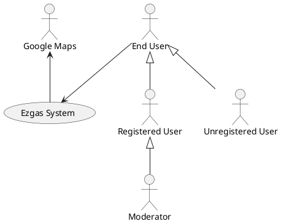
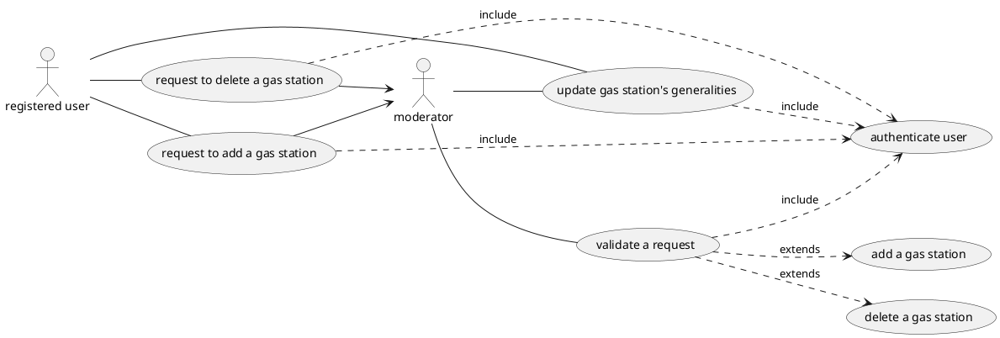
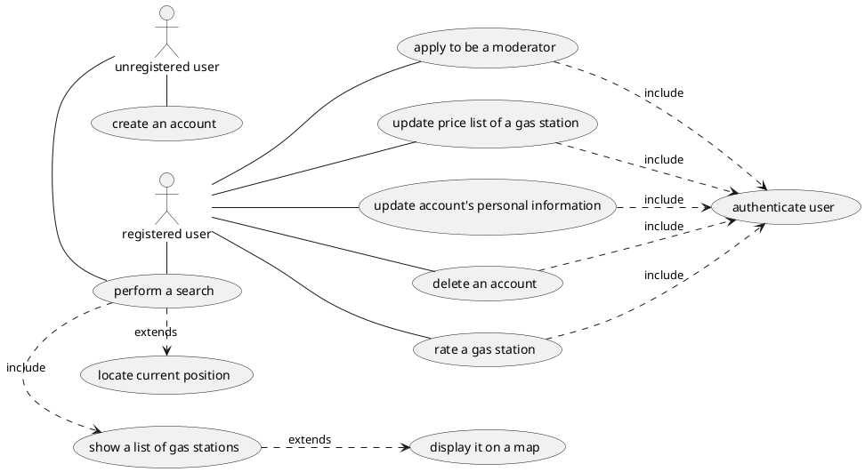
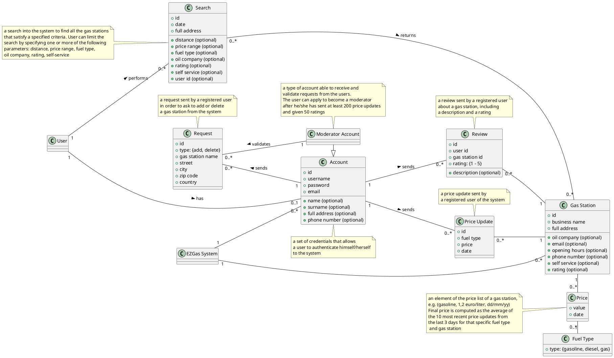
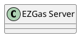
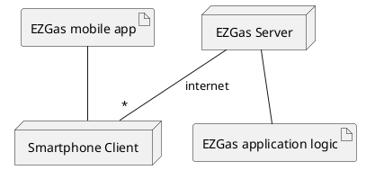

# Requirements Document

Authors: Marco Bellavia (s280130), Gabriel Ganzer (s271961), Gianluca Morabito (s277943), Francesco Xia (s277509)

Date:    02/06/2020

Version: 1.1

Changelog: v1.1:
* change the context diagram
    * from simple line to an arrow
* change the deployment diagram
    * add cardinality to the relation  "server -- phone"

# Contents

- [Abstract](#abstract)
- [Stakeholders](#stakeholders)
- [Context Diagram and interfaces](#context-diagram-and-interfaces)
    + [Context Diagram](#context-diagram)
    + [Interfaces](#interfaces)
- [Stories and personas](#stories-and-personas)
- [Functional and non functional requirements](#functional-and-non-functional-requirements)    
    + [Functional Requirements](#functional-requirements)
    + [Non functional requirements](#non-functional-requirements)
- [Use case diagram and use cases](#use-case-diagram-and-use-cases)
    + [Use case diagram](#use-case-diagram)
    + [Use cases](#use-cases)
    + [Relevant scenarios](#relevant-scenarios)
- [Glossary](#glossary)
- [System design](#system-design)
- [Deployment diagram](#deployment-diagram)

# Abstract

People driving a car, a truck or a motorbike, whether they have a gasoline, diesel or gas engine, need to get fuel from gas stations. The choice of a gas station is made considering mainly two factors: closeness to the pump and price of the fuel.
A team of developers decides to make this process easier by developing an application that retrieves data from the people contribution (crowdsourcing). Who downloads the app can use it either to locate the closest gas stations in the area along with their fuel prices or to contribute by updating the fuel price in an existing gas station. The application is able to show the gas stations both through a list view or a map view, while the fuel prices, specified for a gas station, are computed considering the average value of the 10 most recent fuel price updates from the last 3 days.
The users have different ways to interact with the system, besides searching, such as: ask for new gas stations to be added into the system, send reviews of gas stations and price updates, thus the app can always be kept up to date.

# Stakeholders

| Stakeholder name | Description |
| ---------------- |:-----------:|
| End User | person who ultimately uses the application. The EZgas system differentiates 3 types of users: 1. unregistered user. 2. registered user 2.1. moderator (a registered user with additional privileges) |
| Developer | person responsible for building and writing the web application |
| Google Maps | system responsible for locating geographically the gas stations|

# Context Diagram and interfaces

## Context Diagram

## Interfaces

| Actor | Logical Interface | Physical Interface |
| ----- |:-----------------:|:------------------:|
| End User | GUI | touch screen |
| Google Maps | API | internet connection |

# Stories and personas

Eleanor is a young regional volleyball referee that cares about a smart management of her outgoings. She owns a car with a diesel engine and because of her job she often needs to drive it around the region she lives in to reach all the sports hall where volley matches are held.
During her job trips, Eleanor always takes the smartphone and uses the navigator application to get oriented in highways and cities she has never visited before. Frequently happens that she runs low on fuel so that she needs to find a gas station as soon as possible, preferably one from her favorite oil company where she can gain fidelity points for every liter of purchased fuel. Otherwise, she tends to choose the closest gas station that has the lowest fuel price.

Barbara is a mother with a son and a daughter. Every morning, before going to work, she brings them to primary school following always the same street path that includes passing by two gas stations from two different oil companies. Barbara wants to be an example for her children and so, when she arrives at work, she always tells her colleagues about the fuel prices she has read while driving the car, in order to let them choose the cheapest option if they need to fill up the tank.

Max is a 26 years old boy owning a motorbike that he uses a lot for traveling around the country. He likes sharing with other people his driving experiences and, in order to do this, he always gives reviews and comments about the places he goes to during his travels. He would certainly give a powerful boost to a crowdsourcing application and become soon a moderator, able to analyze requests from users just like Max’s friends usually do with him.

Patrick is a gas station owner really inclined to new technologies and everyday-use applications. He always does his best to let his customers satisfied with the services and quality offered by his own gas station. He would be really interested in a way to allow everybody to know he has one of the best gas stations, with the best possible rating and, almost always, the lower fuel prices in the area.

# Functional and non-functional requirements

## Functional Requirements

| ID | DESCRIPTION |
| -- |:-----------:|
| FR1 | **Authenticate an user** |
| FR1.1 | log in to the system |
| FR1.2 | log out from the system |
| FR2    | **Manage the price list of a gas station** |
| FR2.1 | update the price list of a gas station |
| FR2.2 | show the price list of a gas station |
| FR3    | **Perform a search** |
| FR3.1 | perform a search using a set of filters |
| FR3.2a | show on screen a list of gas stations |
| FR3.2b | show on a map a list of gas stations  |
| FR3.3 | locate the current position of a device |
| FR4    | **Manage new and existing accounts** |
| FR4.1 | create an account |
| FR4.2 | modify the personal information (i.e. name, surname, password, phone number...) associated with an account |
| FR4.3 | delete an existing account from the system |
| FR4.4 | apply to become moderator |
| FR5    | **Manage new and existing gas stations** |
| FR5.1 | send a request to add a new gas station |
| FR5.2 | send a request to delete a gas station from the system |
| FR5.3 | view and validate a request made by a registered user |
| FR5.4 | add a new gas station to the system |
| FR5.5 | delete a gas station from the system |
| FR5.6 | update the generalities (e.g. name, phone number, opening hours, brand) associated to a gas station |
| FR5.7 | give a rating to a gas station |

## Non Functional Requirements

| ID | TYPE | DESCRIPTION |
| -- |:----:|:------------|
|NFR1 | Efficiency | the system must respond within 1 second for each request made by the user |
|NFR2 | Portability | the app should be available and compatible with the following mobile operating systems: iOS ver.13 and up, Android ver.10 and up |
|NFR3 | Localization | the prices are shown in euro/liter |
|NFR4 | Localization | the web application is available in the following languages: English, Italian |
|NFR5 | Privacy | the web application is compliant with the Regulation (EU) 2016/679 (GDPR) |

# Use case diagram and use cases

### USE CASE 1 "user sends a price update" (ref. FR2.1)

| Actors Involved | A registered user |
| --------------- |:-----------------:|
| Precondition | 1. user must be authenticated; 2. user must have selected a gas station from the results of a search|
| Postcondition | 1. the price list of the corresponding gas station has been updated |
| Nominal Scenario | 1. user fills the form with the required fields, i.e. fuel type and price; 2. system confirms the operation has been successful |
| Variants | 2a. systems sends back an error message to the user because the price suggested is out of boundary |

### USE CASE 2 "generic user performs a conditional search using a set of filters" (ref. FR3)

| Actors Involved | A generic user (registered, unregistered) |
| --------------- |:-----------------------------------------:|
| Precondition | |
| Postcondition | |
| Nominal Scenario | 1. user fills in the address information (i.e. street, city, zip code, country) and optionally applies a set of filters; 2. system shows a list of gas stations that meet the criteria |
| Variants | 1a. user sets the address with his current position (*ref. FR3.3*). Follow either *step 2* or *step 2.a*; 2a. system shows the list of gas stations on a map |

### USE CASE 3 "unregistered user sign up for a new account" (ref. FR4.1)

| Actors Involved | An unregistered user |
| --------------- |:--------------------:|
| Precondition | |
| Postcondition | 1. the information about the newly created account has been successfully stored in the system |
| Nominal Scenario | 1. user fills in the minimum required information. (i.e. username, password, email); 2. system sends to the user an email containing the activation link; 3. user completes the registration by clicking the link |
| Variants | 2a. system denies the request. A request can be denied for one or more of the following reasons: username is already taken, password is too weak, and email address is invalid/already taken. User may retry, return to nominal scenario at step 1; 1a. user signs up using an existing Google account |

### USE CASE 4 "user updates his/her personal information associated to his/her account" (ref. FR4.2)

| Actors Involved | A registered user |
| --------------- |:-----------------:|
| Precondition | 1. user must be authenticated |
| Postcondition | 1. the information related to the account has been updated in the system |
| Nominal Scenario | 1. user updates his/her personal information (e.g. name, surname, password, phone number); 2. system confirms the operation has been successful |
| Variants | 2a. system denies the request because the new password chosen by the user is not compliant with the minimum requirements. User may retry, return to the nominal scenario at step 1 |

### USE CASE 5 "user deletes his/her account" (ref. FR4.3)

| Actors Involved | A registered user |
| --------------- |:-----------------:|
| Precondition | 1. user must be authenticated |
| Postcondition | 1. the account has been deleted from the system |
| Nominal Scenario | 1. user sends a request to delete his/her account; 2. system confirms the operation has been successful |
| Variants | |

### USE CASE 6 "user applies to become a moderator " (ref. FR4.4)

| Actors Involved | A registered user |
| --------------- |:-----------------:|
| Precondition | 1. the registered user must have sent at least 200 price updates and 50 reviews |
| Postcondition | |
| Nominal Scenario | 1. user applies to become a moderator; 2. system confirms the operation has been successful |
| Variants | |

### USE CASE 7 "user sends a request to add a new gas station into the system" (ref. FR5.1, FR5.3, FR5.4)

| Actors Involved | A registered user, a moderator |
| --------------- |:------------------------------:|
| Precondition | 1. user must be authenticated |
| Postcondition | 1. the information about the new gas station has been successfully stored in the system|
| Nominal Scenario | 1. a registered user fills in the minimum information required for adding a new gas station (i.e. gas station name, street, city, zip code and country); 2. a moderator verifies and validates the information (e.g. checks if the gas station is already in the system, checks if the inserted information are syntactically correct); 3. the moderator adds the gas station into the system |
| Variants | 3a. the moderator denies the request for one or more of the following reasons: the gas station is already available in the system, the information presented in the request are syntactically incorrect |

### USE CASE 8 "user sends a request to delete a gas station from the system" (ref. FR5.2, FR5.3, FR5.5)

| Actors Involved | A registered user, a moderator|
| --------------- |:-----------------------------:|
| Precondition | 1. user must have selected a gas station from the results of a search |
| Postcondition | 1. the gas station has been deleted from the system |
| Nominal Scenario | 1. a registered sends a request to delete that particular gas station; 2. a moderator verifies and validates the request (e.g. checks if the gas station still exists in the real world, for example, by calling/sending an email to the involved gas station); 3. the moderator deletes the gas station from the system |
| Variants | 3a. the moderator denies the request since the gas station still exists in the real world |

### USE CASE 9 "user updates the generalities of a gas station" (ref. FR5.6)

| Actors Involved | A registered user |
| --------------- |:---------------:|
| Precondition | 1. user must be authenticated; 2. user must have selected a gas station from the results of a search |
| Postcondition | 1. the information related to the gas station has been updated in the system|
| Nominal Scenario | 1. a registered user sends a request containing updated information associated to a gas station (e.g. gas station name, opening-hours, phone number, email); 2. system confirms the operation has been successful |
| Variants | 2a. system denies the request since the information inserted are syntactically incorrect. User may retry, return to the nominal scenario at step 1 |

### USE CASE 10 "a user rates a gas station" (ref. FR5.7)

| Actors Involved | A registered user |
| --------------- |:-----------------:|
| Precondition | 1. user must be authenticated; 2. user must have selected a gas station from the results of a search |
| Postcondition | 1. the rating corresponding to that particular gas station has been updated |
| Nominal Scenario | 1. user sends a review with a rating (0-5) for that particular gas station; 2. system confirms the operation has been successful |
| Variants | 2a. system denies the request made by the user since it is not the first review made by the user to this particular gas station |

# Relevant scenarios

## Scenario 1

| Scenario ID: SC1 | Corresponds to UC1 |
| ---------------- |:------------------:|
| Description | User uses the application to update the fuel price |
| Precondition | User must be authenticated |
| Post Condition | Fuel price has been updated |
| Step # | Step Description |
| 1 | User finds and selects a specific gas station using the search functionality of the application |
| 2 | User selects the type of fuel to be updated and defines the cost |
| 3 | Application confirms the pricing update with a pop-up message |

## Scenario 2

| Scenario ID: SC2 | Corresponds to UC2 |
| ---------------- |:------------------:|
| Description | Unregistered user wants to find a gas station |
| Precondition | |
| Post Condition | |
| Step # | Step Description |
| 1 | User searches for the gas station by entering a specific address and applying a set of filters |
| 2 | Application shows the results as a list of gas stations |

## Scenario 3

| Scenario ID: SC3 | Corresponds to UC3 |
| ---------------- |:------------------:|
| Description | Unregistered user wants to create a new account |
| Precondition | |
| Post Condition | Account has been created |
| Step # | Step Description |     
| 1 | User selects the registration page |
| 2 | User fills out the form by entering the personal data (username, email, password) and confirms |
| 3 | System sends a confirmation email to the email address entered |
| 4 | User confirms the email address by opening the link received in the email |
| 5 | System creates the account and sends a welcoming email to the new user |

## Scenario 4

| Scenario ID: SC4 | Corresponds to UC5 |
| ---------------- |:------------------:|
| Description | User deletes his account |
| Precondition | User must be authenticated |
| Post Condition | Account has been deleted |
| Step # | Step Description |
| 1 | User selects his/her profile |
| 2 | User sends a request to delete his/her account |
| 3 | System deletes the account and shows a pop-up message to inform the user |

## Scenario 5

| Scenario ID: SC5 | Corresponds to UC7 |
| ---------------- |:------------------:|
| Description | User wants to add a new gas station into the system |
| Precondition | User must be authenticated |
| Post Condition | New gas station has been added into the system |
| Step # | Step Description |
| 1 | User selects the page for adding a new gas station|
| 2 | The user fills out the request for the new station by entering the information like gas station name, street, city, zip code and country and confirms |
| 3 | Moderator checks and validates the request |
| 4 | Moderator adds the gas station into the system |
| 5 | System sends an email to the user about the outcome of the request |
 
## Scenario 6

| Scenario ID: SC6 | Corresponds to UC10 |
| ---------------- |:-------------------:|
| Description | User sends a review of a gas station |
| Precondition | User must be authenticated |
| Post Condition | Review has been included in the description of the gas station |
| Step # | Step Description |
| 1 | User performs a search (see SC2) |
| 2 | User selects the profile page of a gas station |
| 3 | User inserts his/her comment and a rating that varies from 0 to 5 stars |
| 4 | User sends the review and receives a pop-up message |

# Glossary

An optional attribute is a property of a class that can be left unchecked, e.g. the telephone number associated with a gas station can be empty.

# System Design

It is not meaningful in our case since the EZGas system is just a web application

# Deployment Diagram

